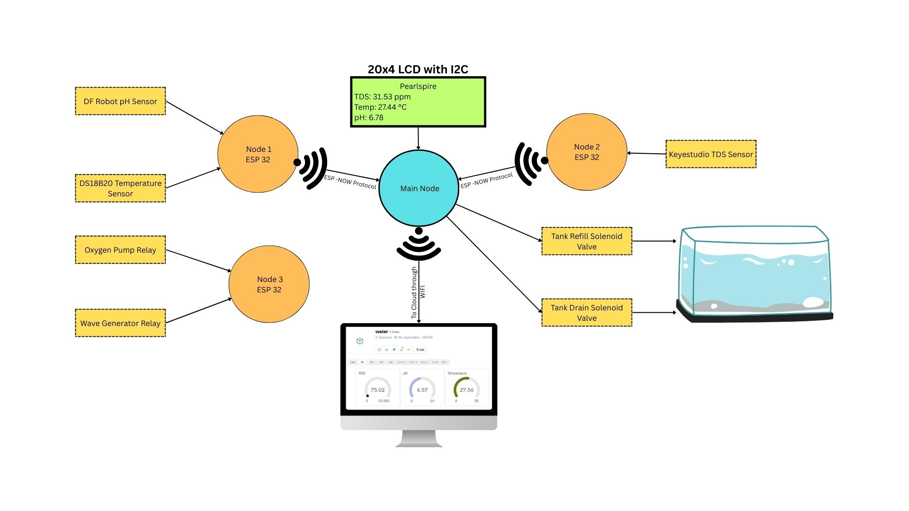
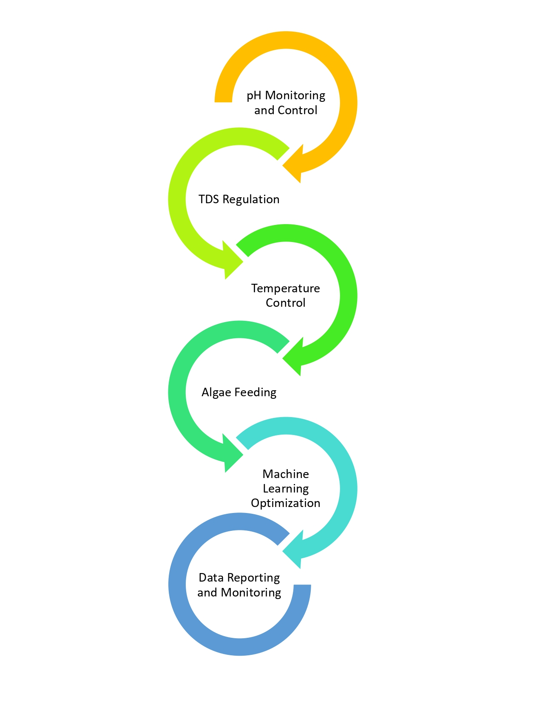

# 🦪 IoT-Based Pearl Farm Health Regulator

<div align="center">



[](docs/patent.pdf)
[](docs/IIT%20BOMBAY-Sanction%20letter.pdf)
[](https://ieeexplore.ieee.org/document/11336776)
[](LICENSE)

**An intelligent IoT system for real-time water quality monitoring and automated regulation in freshwater pearl aquaculture.**

*Awarded the TIH Chanakya Fellowship (₹6,00,000) by IIT Bombay | Design Patent Granted | Published in IEEE Xplore*

[📄 IEEE Paper](https://ieeexplore.ieee.org/document/11336776) · [🔬 System Architecture](#system-architecture) · [📊 Results](#results--validation) · [🚀 Getting Started](#getting-started)

</div>

---

## 🧠 Project Overview

Pearl farming is a precision-sensitive aquaculture process where water quality parameters — pH, Total Dissolved Solids (TDS), and temperature — directly determine oyster survival, nacre formation, and pearl quality. Manual monitoring is slow, inaccurate, and scales poorly.

This project delivers a **deployment-ready IoT solution** that automates water quality monitoring and regulation for freshwater pearl farms. The system integrates embedded sensing, edge computing, cloud telemetry, and electromechanical actuation into a compact, farmer-operable device — validated in a live 10,000 L pearl farming tank with 3,000 oyster shells.

> **Key Insight:** The system reduced manual monitoring effort by ~70%, maintained water parameters within ±5% of target, and autonomously triggered water exchange cycles without human intervention.

---

## ✨ Key Achievements

| Achievement | Details |
|---|---|
| 🏛️ **Design Patent Granted** | Patent No. 454051-001 · Granted 02/04/2025 |
| 🏆 **TIH Chanakya Fellowship** | ₹6,00,000 grant from IIT Bombay's Technology Innovation Hub |
| 📡 **IEEE Xplore Published** | ICFT 2025 · [ieeexplore.ieee.org/document/11336776](https://ieeexplore.ieee.org/document/11336776) |
| 🌾 **Field Deployment** | Validated in real pearl farm · Kolhapur, Maharashtra · Dec 2024 – Oct 2025 |
| ⚙️ **Full Automation** | Automated water replacement, oxygen regulation, wave generation |

---
## 🔬 System Architecture


### Key Engineering Decision — Why ESP-NOW + Separate Actuator Node?
...rest stays same

```

### Key Engineering Decision — Why ESP-NOW + Separate Actuator Node?

> **Problem:** Initial design used 3 separate ESP32 boards all on the same Wi-Fi + MQTT simultaneously. This caused ADC2 conflicts with Wi-Fi, MQTT packet collisions, and system instability.
>
> **Solution:** Split into two dedicated nodes communicating over **ESP-NOW** (peer-to-peer, no router needed, ~1ms latency). The main node handles all sensing. The actuator node handles relays, oxygen pump, wave generator, and cloud upload — eliminating all interference.

📐 [Detailed system architecture →](docs/system_architecture.md)

---

## 🛠️ Hardware Components

| Component | Specification | Role |
|---|---|---|
| **ESP32 DevKit V1** | Dual-core, Wi-Fi + BT, 3.3V, multiple GPIOs | Main sensor node + actuator node |
| **DFRobot pH Sensor V2** | 0–14 pH, ±0.1, BNC probe, internal EEPROM | Water acidity monitoring |
| **Keyestudio TDS Sensor** | 0–1000 ppm, ±10% FS, 0–2.3V output | Dissolved solids measurement |
| **DS18B20** | -55°C to +125°C, ±0.5°C, One-Wire | Water temperature monitoring |
| **Solenoid Valves** | 12V DC, normally closed | Automated water inlet/outlet control |
| **20×4 I2C LCD** | I2C, 20 columns × 4 rows | On-field real-time display |
| **Relay Module** | 5V trigger, 12V load switching | Controls pumps, valves, wave generator |
| **Oxygen Pump** | Submersible, relay-controlled | Aeration every 5 minutes |
| **Wave Generator** | Timer-controlled | Water circulation every 30 seconds |

📋 [Full component list with specifications →](docs/component.pdf)

---

## 💻 Software Stack

- **Embedded Firmware:** Arduino IDE · Embedded C/C++
- **Communication Protocols:** ESP-NOW · One-Wire · HTTP POST
- **Cloud Platforms:** Blynk · ThingSpeak · Google Sheets (auto-logging every 2 hrs)
- **Signal Processing:** Moving Average Filter (10 samples) · Temperature Compensation for pH/TDS
- **Automation Logic:** Threshold-based control with hysteresis (prevents valve chattering)

🔧 [Working principle explained →](docs/working_principle.md) · [Features list →](docs/features.md)

---

## 🔁 Control Logic & Automation

```
Sensor Reading (every 2 sec via ESP-NOW)
        │
        ▼
 ┌──────────────────────────────────┐
 │  pH < 6.0 or pH > 8.0?          │──YES──► Open Drain Valve (RELAY_1)
 │  TDS > 550 ppm?                  │         Wait 2.5 minutes
 └──────────────────────────────────┘         Open Fill Valve  (RELAY_2)
        │ NO                                  Wait 2.5 minutes → Done
        ▼
 Continue monitoring
 Upload to Blynk every 5 minutes
 Upload to ThingSpeak every cycle
 Display on 20×4 LCD in real time
```

**Additional timed automation:**
- Oxygen pump toggles every **5 minutes** for consistent aeration
- Wave generator activates every **30 seconds** for water circulation

---

## 📊 Results & Validation

Deployed in a **10,000 L freshwater pearl farming tank** with **3,000 oyster shells**, Kolhapur, Maharashtra. Four distributed sensor nodes installed for spatial coverage.

| Metric | Result |
|---|---|
| **Monitoring Accuracy** | ±5% error across all three parameters |
| **pH Control** | Maintained between 6.0 – 8.0 autonomously |
| **TDS Control** | Maintained below 550 ppm via automated exchange |
| **Manual Monitoring Reduction** | ~70% reduction in farmer intervention |
| **System Uptime** | Continuous operation Dec 2024 – Oct 2025 |
| **Data Logging** | Automatic every 2 hours into Google Sheets |
| **Remote Access** | Live dashboard on Blynk app + ThingSpeak |

📈 [Detailed results and data analysis →](docs/results.md)

---

## 🧪 Sensor Calibration Methodology

pH sensor calibration was performed using **two-point calibration** with standard buffer solutions:

```
Step 1: Place probe in pH 7.0 buffer solution
        Send command: "enterph" → enters calibration mode
        Send command: "calph"   → stores slope/offset in EEPROM

Step 2: Repeat with pH 4.0 buffer solution
        Calibration data persists across power cycles

Step 3: Verify against reference instrument
        Acceptable error: ±0.1 pH
```

DS18B20 temperature readings were cross-validated against a mercury thermometer reference. TDS readings include temperature compensation to correct for ionic mobility variation.

---

## 📐 System Flowchart



---

## 🚀 Getting Started

### Prerequisites

- Arduino IDE 2.x with ESP32 board package installed
- Required Libraries (install via Library Manager):
  - `BlynkSimpleEsp32`
  - `OneWire` + `DallasTemperature`
  - `LiquidCrystal_I2C`

### Installation

```bash
git clone https://github.com/atharav-todkar/IoT-based-pearl-farm-health-regulator.git
cd IoT-based-pearl-farm-health-regulator
```

1. Go to `firmware/esp32_main_node/`
2. Copy `config.h.example` → `config.h`
3. Fill in your Wi-Fi, Blynk, and ThingSpeak credentials in `config.h`
4. Flash `esp32_main_node.ino` to the first **ESP32** (sensor node)
5. Flash `firmware/esp32_actuator_node/esp32_actuator_node.ino` to the second **ESP32**
6. Update MAC addresses in `config.h` (run a MAC scanner sketch first)
7. Calibrate pH sensor via Serial Monitor: type `enterph` then `calph`
8. Power on → verify 20×4 LCD → check Blynk + ThingSpeak dashboards

> ⚠️ `config.h` is in `.gitignore` — it will never be committed. Never paste credentials directly in `.ino` files.

📖 [Detailed working principle →](docs/working_principle.md)

---

## 🗂️ Repository Structure

```
IoT-based-pearl-farm-health-regulator/
│
├── docs/
│   ├── Block_Diagram.jpg            # System architecture diagram
│   ├── Flowchart.jpg                # Control logic flowchart
│   ├── component.pdf                # Full BOM with datasheets
│   ├── patent.pdf                   # Granted design patent
│   ├── IIT BOMBAY-Sanction letter.pdf  # TIH fellowship proof
│   ├── ieee paper.docx              # ICFT 2025 IEEE paper
│   ├── contributors.md              # Team roles & contributions
│   ├── system_architecture.md       # Architecture description
│   ├── working_principle.md         # Sensor & circuit working
│   ├── features.md                  # Feature list
│   ├── objectives.md                # Project objectives
│   ├── results.md                   # Test results & data
│   ├── future_scope.md              # Planned enhancements
│   ├── comparison.md                # Comparison with existing systems
│   └── problem_statement.md         # Problem & motivation
│
├── firmware/
│   ├── esp32_main_node/
│   │   ├── esp32_main_node.ino      # Main sensor node firmware
│   │   └── config.h.example         # Credentials template (safe to commit)
│   ├── esp32_actuator_node/
│   │   └── esp32_actuator_node.ino  # Actuator + relay control firmware
│   └── reference_sketches/
│       ├── tds_only.ino             # Early TDS-only test sketch
│       ├── tds_ph_combined.ino      # Mid-iteration TDS + pH sketch
│       └── ph_calibration_test.ino  # pH calibration sketch (Arduino Uno)
│
├── .gitignore                       # Excludes config.h (credentials)
└── README.md
```

---

## 📄 Publication

> **"IoT-Based Pearl Farm Health Regulator"**
> Swaroop Bharat Thikane, Savita Sidram Totad, Atharav Ramchandra Todkar, Vaishnavi Raju Pawar, Vedant Vishwanath Joshi, Dr. Jayashree P. Kharat
> *International Conference on Future Technologies (ICFT 2025)*
> **Published in IEEE Xplore Digital Library**

[](https://ieeexplore.ieee.org/document/11336776)

---

## 🔮 Future Scope

- [ ] **Dosing Pump Integration** — automated pH correction without full water replacement
- [ ] **Dissolved Oxygen (DO) & Turbidity Sensors** — expanded parameter monitoring
- [ ] **Solar Power** — energy-autonomous field deployment
- [ ] **Machine Learning** — predictive water quality forecasting using logged data
- [ ] **Mobile App** — push notifications and farmer alert system
- [ ] **Multi-Tank Scaling** — distributed monitoring across interconnected ponds
- [ ] **Chiller/Heater Integration** — precise thermal regulation under seasonal variation

📋 [Full future scope →](docs/future_scope.md)

---

## 👥 Team

| Name | Role | Institution |
|---|---|---|
| **Atharav Ramchandra Todkar** | Hardware Design, System Integration, Field Deployment | DKTE's Textile & Engineering Institute |
| **Swaroop Bharat Thikane** | Firmware Development, IoT Communication, Cloud Integration | DKTE's Textile & Engineering Institute |
| **Savita Sidram Totad** | Sensor Calibration, Accuracy Testing, Documentation | DKTE's Textile & Engineering Institute |
| **Vaishnavi Raju Pawar** | Dashboard Development, Data Visualization | DKTE's Textile & Engineering Institute |
| **Vedant Vishwanath Joshi** | Field Testing, Documentation, Results Analysis | DKTE's Textile & Engineering Institute |

**Faculty Guide:** Dr. Jayashree Prashant Kharat, Professor — DKTE's Textile & Engineering Institute, Ichalkaranji *(Shivaji University, Kolhapur)*

📋 [Detailed individual contributions →](docs/contributors.md)

---

## 📜 Patent

**Design Patent No. 454051-001** — *"IoT-Based Pearl Farming Device"*
Granted: 02 April 2025 · Inventors: J.P. Kharat, S. Thikane, S. Totad, A. Todkar, V. Pawar, V. Joshi, DKTE Society

[View Patent Document →](docs/patent.pdf)

---

## 💰 Funding

This project was supported by the **Technology Innovation Hub (TIH) for IoT & IoE, IIT Bombay** under the **Chanakya Fellowship Programme**.

- **Grant Number:** TIH-IOT/2024-11/HRD/CHANAKYA/SL/CFP/041
- **Funding Amount:** ₹6,00,000
- **Duration:** December 2024 – October 2025

[View Sanction Letter →](docs/IIT%20BOMBAY-Sanction%20letter.pdf)

---

## 🔍 Problem Statement & Objectives

📄 [Problem statement →](docs/problem_statement.md) · [Project objectives →](docs/objectives.md) · [Comparison with existing systems →](docs/comparison.md)

---

## 📬 Contact

**Atharav Ramchandra Todkar**
B.E. Electronics & Telecommunication Engineering
DKTE's Society's Textile and Engineering Institute, Ichalkaranji
📧 etcartodkar@dkte.ac.in
🔗 [GitHub](https://github.com/atharav-todkar)

---

<div align="center">

*Built with precision for real-world aquaculture · Validated in field · Funded by IIT Bombay*

⭐ If this project helped your research or inspired your work, please consider starring the repository.

</div>
