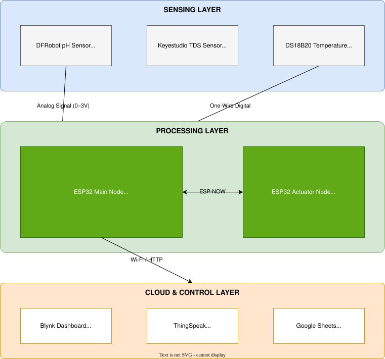

# System Architecture

The IoT-Based Pearl Farm Health Regulator is built on a 
three-layer architecture designed for reliability and modularity.

## Layer 1 — Sensing Layer
- **DFRobot pH Sensor** — 0–14 pH, analog output 0–3V → GPIO 33 (ADC1)
- **Keyestudio TDS Sensor** — 0–1000 ppm, analog output 0–2.3V → GPIO 34 (ADC1)
- **DS18B20 Temperature** — -55°C to +125°C, One-Wire digital → GPIO 4

## Layer 2 — Processing Layer
- **ESP32 Main Node** — reads all sensors, applies averaging filter 
  and temperature compensation, communicates via ESP-NOW
- **ESP32 Actuator Node** — receives data via ESP-NOW, controls 
  solenoid valves, oxygen pump, and wave generator via relays

## Layer 3 — Cloud & Control Layer
- **Blynk** — real-time farmer mobile monitoring
- **ThingSpeak** — time-series graphs and trend analysis
- **Google Sheets** — automatic data logging every 2 hours
